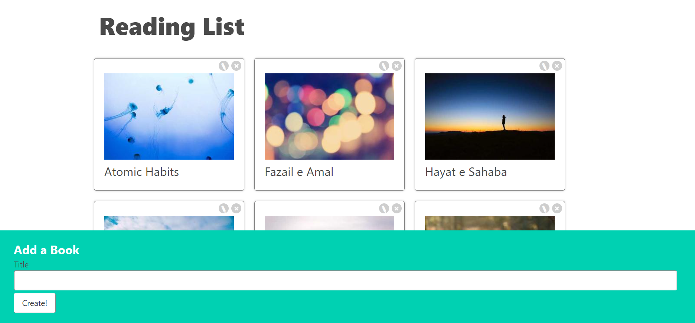

# How to handle forms in React
Add the books, remove and edit the title of the book.

# Features
- React Based
- Books Shelf
- Forms
- Props
- State
- context
- Event Handling
- axios
- json-server
- Picsum.photos

## JSON Server Setup
-  Install JSON-Server with npm at the terminal `npm install json-server`
-  Create a `db.json` file. This is where data will be stored
-  Create a command to run JSON-Server
-  Run the command

This project was bootstrapped with `Create React App`

### Available Scripts

In the project directory, you can run:

#### `npm start`

#### `npm run server`

#### `npm test`

#### `npm run build`

#### `npm run eject`